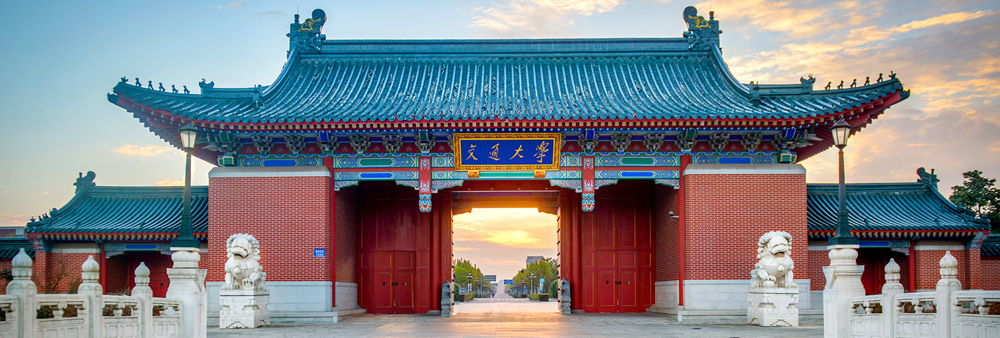








I am  a Ph.D. student at the Institute of Intelligent Vehicles, Shanghai Jiao Tong University (SJTU). My research interests focus on **end-to-end autonomous driving** and **vision-language-action (VLA) for autonomous driving**. In parallel, I serve as a Strategy Intern at Bosch Corporate Research Institute, engaging in frontier research on autonomous driving.

**Note: I am committed to advancing research in autonomous driving and actively seek opportunities to collaborate with partners from academia and industry. If you are interested in potential projects or idea exchanges, please feel free to contact me at [hao.jiang@sjtu.edu.cn](https://mail.google.com/mail/u/0/?tab=rm&ogbl#inbox?compose=new).**

# 🔥 News
- *2025.09*: 🔥 We released **FlowDrive** ! [Check it out !](https://astrixdrive.github.io/FlowDrive.github.io/)  
- *2025.06*: 🔥 We released **FastDrive** ! [Check it out !](https://arxiv.org/abs/2506.05442)
- *2025.05*: 🎉 One paper is accepted by [IEEE Internet of Things Journal (IoT-J)](https://ieeexplore.ieee.org/abstract/document/10988688) ! **(SCI Q1, top, IF=8.9)**
- *2024.12*: 🎉 One paper is accepted by [IEEE Transactions on Intelligent Vehicles (TIV)](https://ieeexplore.ieee.org/abstract/document/10816591) ! **(SCI Q1, top, IF=14.3)**
- *2023.10*: 🎉 One paper is accepted by [CVCI 2023](https://ieeexplore.ieee.org/abstract/document/10816591) ! **(Best Paper Candidate)**

# 📝 Publications 

†:Equal Contribution &nbsp;&nbsp;&nbsp; *:Corresponding Author

arXiv 2025

**FlowDrive: Energy Flow Field for End-to-End Autonomous Driving**

**<ins>_Hao Jiang_</ins>**, Zhipeng Zhang, Yu Gao, Zhigang Sun, Yiru Wang, Yuwen Heng, Shuo Wang, Jinhao Chai, Zhuo Chen, Hao Zhao, Hao Sun, Xi Zhang, Anqing Jiang, Chuan Hu

     

- FlowDrive introduces energy flow fields for more safety end-to-end autonomous driving. 

arXiv 2025

**Structured Labeling Enables Faster Vision-Language Models for End-to-End Autonomous Driving**

**<ins>_Hao Jiang_</ins>**, Chuan Hu, Yukang Shi, Yuan He, Ke Wang, Xi Zhang, Zhipeng Zhang

   

IEEE TIV

**Hybrid Attention-based Multi-task Vehicle Motion Prediction Using Non-Autoregressive Transformer and Mixture of Experts<**

**<ins>_Hao Jiang_</ins>**, Chuan Hu, Yixun Niu, Biao Yang, Hao Chen, Xi Zhang

   

- [Multi-Modal Vehicle Motion Prediction Based on Motion-Query Social Transformer Network for Internet of Vehicles](https://ieeexplore.ieee.org/abstract/document/10988688/). **<ins>_Hao Jiang_</ins>**, Baixuan Zhao, Chuan Hu, Hao Chen, Xi Zhang. **IEEE Internet of Things Journal**
- [Motion Query-based Multimodal Vehicle Trajectory Prediction for Autonomous Driving](https://ieeexplore.ieee.org/abstract/document/10397282). **<ins>_Hao Jiang_</ins>**, Yixun Niu, Chuan Hu, Shuang Hu, Baixuan Zhao, Xi Zhang, Yiwei Lin. **CVCI 2023**
- [Decision-Making for Autonomous Driving Via a Coupled Reinforcement Learning Network Combined With Risk Assessment](https://ieeexplore.ieee.org/document/11091425). Chuan Hu, Yixun Niu, **<ins>_Hao Jiang_</ins>**, Xi Zhang, Xin Cheng. **IEEE Robotics and Automation Letters**

# 🎖 Honors and Awards
- *2024.06* Outstanding Graduate, SJTU 

# 📖 Educations
- *2024.06 - present*, Ph.D., Shanghai Jiao Tong University, Shanghai, China
- *2021.09 - 2024.06*, M.S., Shanghai Jiao Tong University, Shanghai, China 

# 💻 Internships
- *2024.09 - 2025.03*, [KargoBot](https://www.kargo-bot.com/), Shanghai, China.
- *2023.09 - 2024.02*, [Bosch Corporate Research](https://www.bosch.com.cn/careers/), Shanghai, China.

# 🎓 Services
- IEEE Transactions on Intelligent Vehicles [(TIV)](https://ieeexplore.ieee.org/xpl/RecentIssue.jsp?punumber=7274857)
- IEEE Transactions on Transportation Electrification [(TTE)](https://ieeexplore.ieee.org/xpl/RecentIssue.jsp?punumber=6687316)